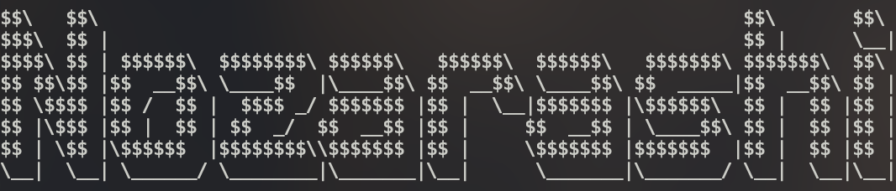

<!-- # Nozarashi -->



Nozarashi orchestrates reproducible [Apple Container](https://github.com/apple/container)
environments from OCI images, Dockerfiles, Containerfiles and Nix inputs.

Define services and resources in `nozarashi.toml`, then manage their images,
containers, networks and volumes as one project.

## Installation

Using Nix:

```sh
# Try before installing ?
nix run github:briheet/nozarashi

# Install
nix profile install github:briheet/nozarashi
```

Using Go:

```sh
# Try before installing ?
go run github.com/briheet/nozarashi/cmd/nozarashi@latest

# Install
go install github.com/briheet/nozarashi/cmd/nozarashi@latest
```

## Requirements

- macOS with Apple Container installed
- Nix when building services from Nix inputs

## Quick start

From a directory containing `nozarashi.toml`:

```sh
# To create resource(volumes and networks) and dns
sudo nozarashi create

# To build and pull images
nozarashi build

# To start containers
nozarashi up
```

`create` registers the project DNS domain and creates its networks and volumes.
DNS registration requires administrator privileges; see Apple’s
[local DNS documentation](https://github.com/apple/container/blob/main/docs/tutorial.md#set-up-a-local-dns-domain-optional).

Use a service name to target one service:

```sh
# Stop the image's container if its running and recreate its image
nozarashi build backend

# Start the container from an image
nozarashi up backend

# Get logs for the container specified
nozarashi logs backend

# Exec commands 
nozarashi exec backend sh
```

## Commands

| Command | Purpose |
| --- | --- |
| `create` | Create project DNS, networks and volumes |
| `build [services...]` | Build or pull service images |
| `up [services...]` | Create and start containers |
| `down [services...]` | Stop containers |
| `restart [services...]` | Restart containers |
| `ps` | List project containers |
| `logs [services...]` | Print container logs |
| `exec <service> <command>` | Run a command in a container |
| `inspect <services...>` | Display container details |
| `destroy` | Delete project containers, images and resources |

See the [configuration specification](docs/SPEC.md) and
[examples](examples) for complete setups and every supported input type.

## License

[MIT](LICENSE)
